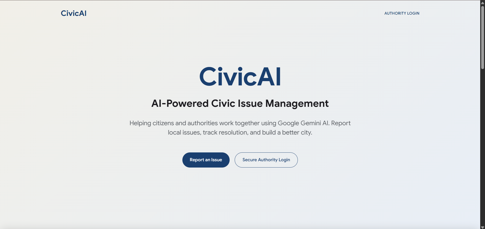
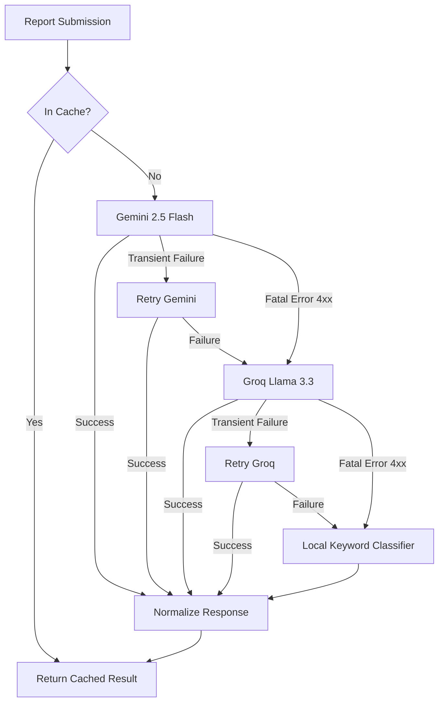
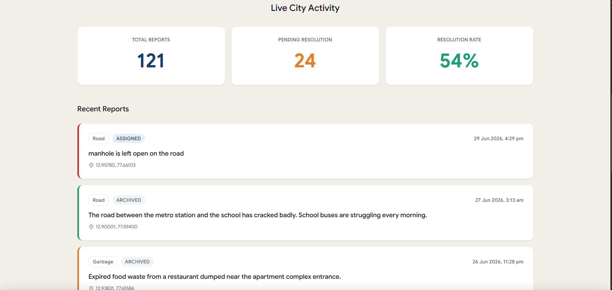
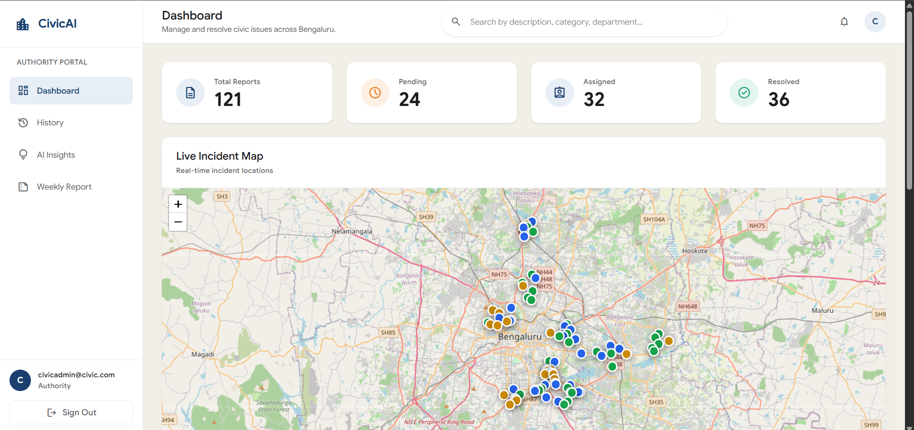
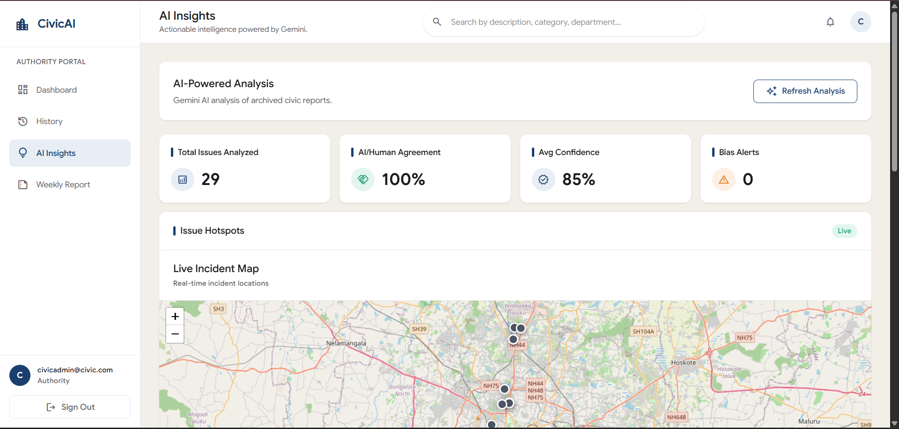
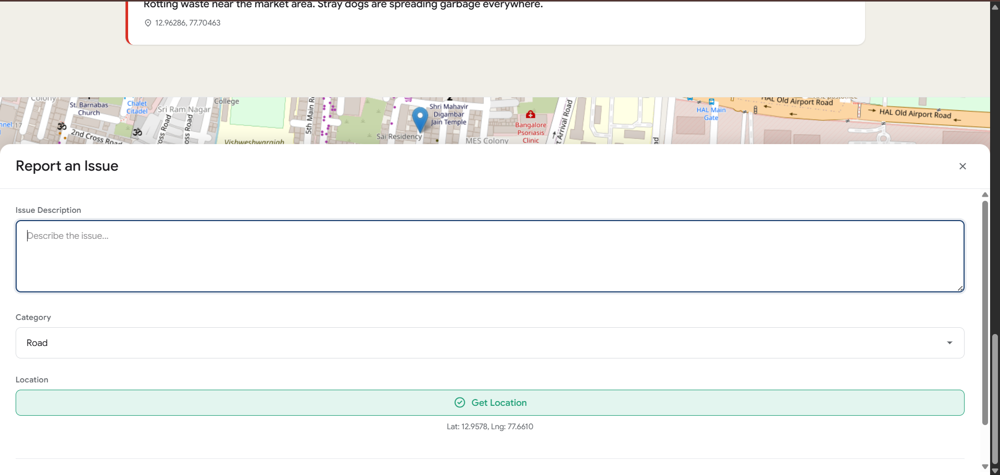
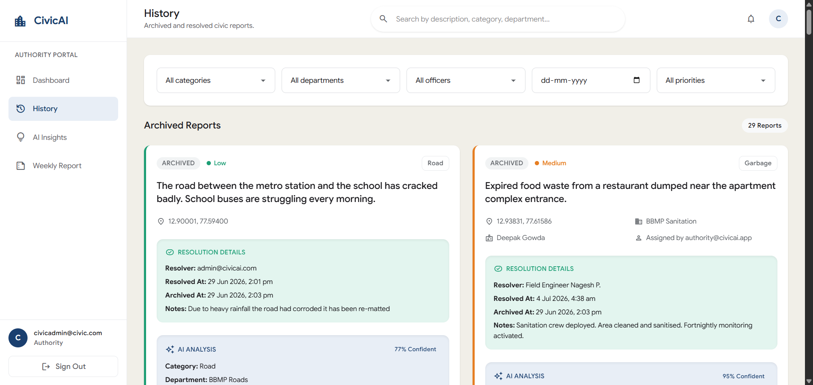

# CivicAI

**The Smart Civic Issue Reporting Platform for India.**

CivicAI is an intelligent, multi-agent civic issue management system that empowers citizens and streamlines municipal authorities to triage, manage, and resolve civic complaints faster.



## 📖 Project Overview

Indian urban centers, particularly cities like Bengaluru, suffer from an overwhelming volume of unorganized civic complaints spanning multiple jurisdictions (BBMP, BWSSB, BESCOM). 

CivicAI solves this by providing a unified reporting interface for citizens. Behind the scenes, it utilizes advanced AI agents to automatically classify issues, assign priorities, detect duplicates, and route complaints to the precise department responsible. It transforms civic reporting from a chaotic black box into a transparent, actionable pipeline.

## ✨ Features

- **AI-Powered Classification:** Automatically routes issues to the correct department (e.g., BESCOM, BWSSB, Traffic Police).
- **Multi-Provider AI Pipeline:** Enterprise-grade reliability using Gemini as the primary engine with Groq as an instant, silent failover.
- **Smart Duplicate Detection:** Identifies semantic duplicates of nearby issues within a 1km radius to prevent authority spam.
- **Authority Dashboard:** Real-time triage board for municipal workers to track Pending, Assigned, and Resolved tasks.
- **Citizen Dashboard & History:** Track the exact status of your submissions securely.
- **Ward-Level Analytics:** AI-generated executive summaries and insights to highlight systemic issues across wards.
- **Session Caching:** Prevents redundant API calls for duplicate submission attempts.
- **Graceful Fallback Classifier:** A deterministic local safety net ensures 100% uptime even if all external AI services fail.

## 🧠 AI Architecture

CivicAI relies on a highly resilient provider chain. The application intercepts all AI requests, verifies them against a session cache, and runs them through a cascading failover system. 



### Triage & Routing
The AI evaluates text descriptions to determine the `category` (Road, Water, Garbage, etc.) and precisely assigns the `department`. It assigns a `priority` (Low to Critical) based on extracted urgency indicators (e.g., "blocking traffic", "live wire").

## 🛠 Tech Stack

| Technology | Purpose |
| :--- | :--- |
| **React 19** | Frontend Framework |
| **Vite** | Build Tool & Dev Server |
| **Firebase Auth** | Secure User Authentication |
| **Firestore** | Real-time NoSQL Database |
| **Google Gemini** | Primary AI Analysis Engine |
| **Groq** | Secondary AI Failover Engine |

## 📂 Project Structure

```text
src/
├── assets/         # Static images and icons
├── components/     # Reusable React UI components (ReportDrawer, Tabs)
├── pages/          # Application views (Dashboards, Login, History)
├── services/
│   ├── firebase.js          # Firebase configuration and DB access
│   ├── ai.js                # Core AI orchestrator
│   ├── fallbackClassifier.js# Local deterministic safety net
│   └── providers/           # Abstracted AI providers (Gemini, Groq)
```

## 🚀 Installation

1. **Clone the repository:**
   ```bash
   git clone https://github.com/CivicAI/civicai.git
   cd civicai
   ```

2. **Install dependencies:**
   ```bash
   npm install
   ```

3. **Configure Environment Variables:**
   Copy `.env.example` to `.env` and fill in your keys:
   ```bash
   cp .env.example .env
   ```

4. **Start the development server:**
   ```bash
   npm run dev
   ```

## 🔐 Environment Variables

You will need the following variables in your `.env` file:

- `VITE_GEMINI_API_KEY`: API Key for Google Gemini (Primary)
- `VITE_GROQ_API_KEY`: API Key for Groq (Secondary)
- `VITE_FIREBASE_API_KEY`: Firebase API Key
- `VITE_FIREBASE_AUTH_DOMAIN`: Firebase Auth Domain
- `VITE_FIREBASE_PROJECT_ID`: Firebase Project ID
- `VITE_FIREBASE_STORAGE_BUCKET`: Firebase Storage Bucket
- `VITE_FIREBASE_MESSAGING_SENDER_ID`: Firebase Messaging Sender ID
- `VITE_FIREBASE_APP_ID`: Firebase App ID

*(Never commit your real `.env` file to version control.)*

## 📸 Screenshots

| Landing Page | Citizen Dashboard |
|:---:|:---:|
|  |  |

| Authority Dashboard | Analytics Dashboard |
|:---:|:---:|
|  |  |

| Report Submission | History |
|:---:|:---:|
|  |  |

## 🔮 Future Roadmap

- [ ] Mobile Application (React Native)
- [ ] AI Image Analysis (currently removed for latency optimization)
- [ ] Predictive Hotspot Detection for City Planners
- [ ] Direct API Integration with BBMP / BWSSB systems
- [ ] Push Notifications for Status Updates
- [ ] Offline Reporting Capabilities

## 👥 Created By

- Siddharth. R 

## 📄 License

This project is licensed under the MIT License - see the [LICENSE](LICENSE) file for details.
